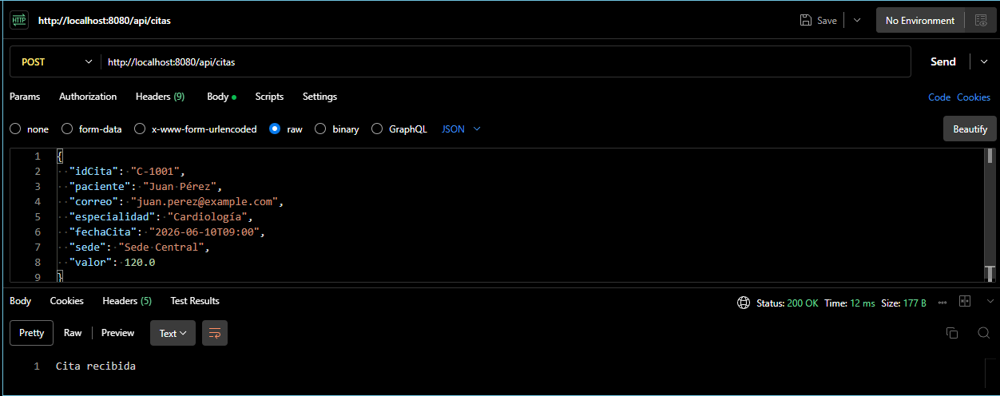
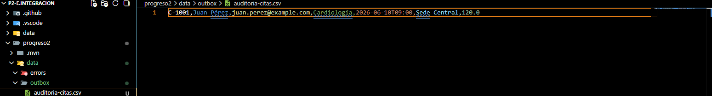
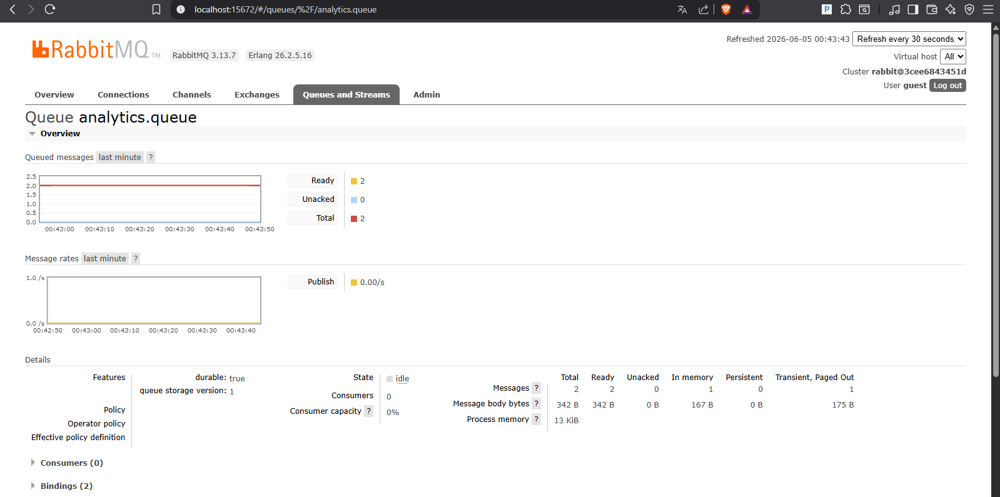
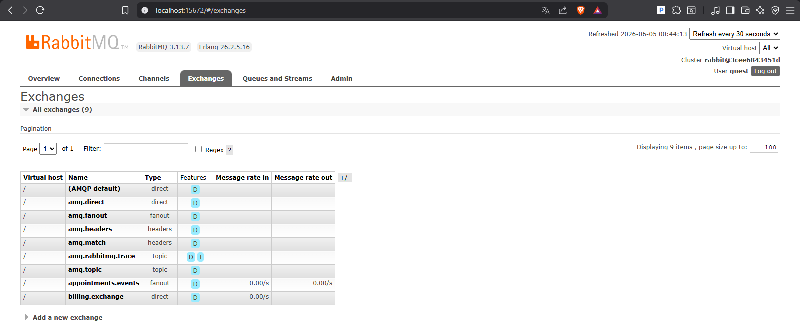
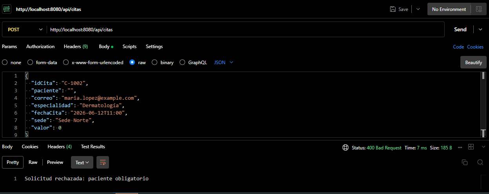
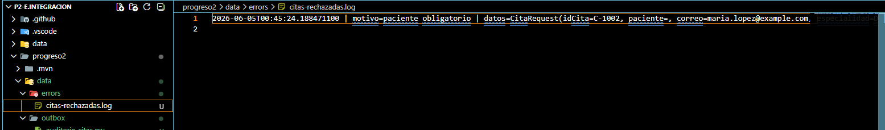

# P2-E.Integracion

## Nombre del estudiante

- Alejandro Moreira

## Descripción breve de la solución

Esta solución implementa un middleware de integración para una clínica, recibiendo citas médicas por REST y distribuido los datos a facturación, eventos de notificación/analítica y auditoría. El flujo incluye validación, envío point-to-point a RabbitMQ, publicación publish/subscribe y registro de auditoría en un archivo CSV.

## Tecnologías utilizadas

- Java 17
- Spring Boot 3
- Apache Camel
- RabbitMQ
- Spring AMQP
- Docker / Docker Compose

## Instrucciones para levantar RabbitMQ

1. Abrir terminal en la carpeta raíz del proyecto:

```powershell
cd "P2-E.Integracion"
```

2. Iniciar RabbitMQ con Docker Compose:

```powershell
docker compose up -d
```

3. Verificar que RabbitMQ esté corriendo en:

- http://localhost:15672

Credenciales:

- Usuario: `guest`
- Contraseña: `guest`

## Instrucciones para ejecutar la aplicación

1. Abrir terminal en la carpeta del servicio:

```powershell
cd "P2-E.Integracion\progreso2"
```

2. Ejecutar la aplicación con Maven Wrapper:

```powershell
.\mvnw.cmd spring-boot:run
```

3. La aplicación quedará disponible en:

- http://localhost:8080

## Endpoint disponible

- `POST http://localhost:8080/api/citas`

## Ejemplo de request válido

```json
{
  "idCita": "C-1001",
  "paciente": "Juan Pérez",
  "correo": "juan.perez@example.com",
  "especialidad": "Cardiología",
  "fechaCita": "2026-06-10T09:00",
  "sede": "Sede Central",
  "valor": 120.0
}
```

## Ejemplo de request inválido

Falta el campo `paciente` y `valor` es cero:

```json
{
  "idCita": "C-1002",
  "paciente": "",
  "correo": "maria.lopez@example.com",
  "especialidad": "Dermatología",
  "fechaCita": "2026-06-12T11:00",
  "sede": "Sede Norte",
  "valor": 0
}
```

## Explicación breve

- Point-to-Point: se aplica en la ruta de facturación cuando el mensaje se envía a `billing.queue` a través del exchange `billing.exchange` con `exchangeType=direct`.
- Publish/Subscribe: se aplica en la ruta de eventos cuando el mensaje se publica en el exchange `appointments.events` con `exchangeType=fanout`, lo que permite que múltiples consumidores reciban el mismo evento.
- Transferencia de archivos: se aplica escribiendo una línea CSV en `data/outbox/auditoria-citas.csv` para auditoría de citas válidas.
- Manejo de errores: la validación de los datos se realiza en `CitaValidationService`; si falla, la API responde `400 Bad Request` y registra el rechazo en `data/errors/citas-rechazadas.log`. Además, si ocurre un error en la ruta Camel, se captura y también se escribe en el mismo archivo de errores.

## Evidencia esperada para verificar el funcionamiento

1. Respuesta HTTP `200 OK` al enviar un request válido a `POST /api/citas`.


2. Archivo `data/outbox/auditoria-citas.csv` contiene la línea del registro de cita.


3. RabbitMQ está accesible en `http://localhost:15672`.


4. Los exchanges `billing.exchange` y `appointments.events` existen en RabbitMQ.


5. En caso de request inválido, la API responde `400 Bad Request` y el archivo `data/errors/citas-rechazadas.log` registra el rechazo.


